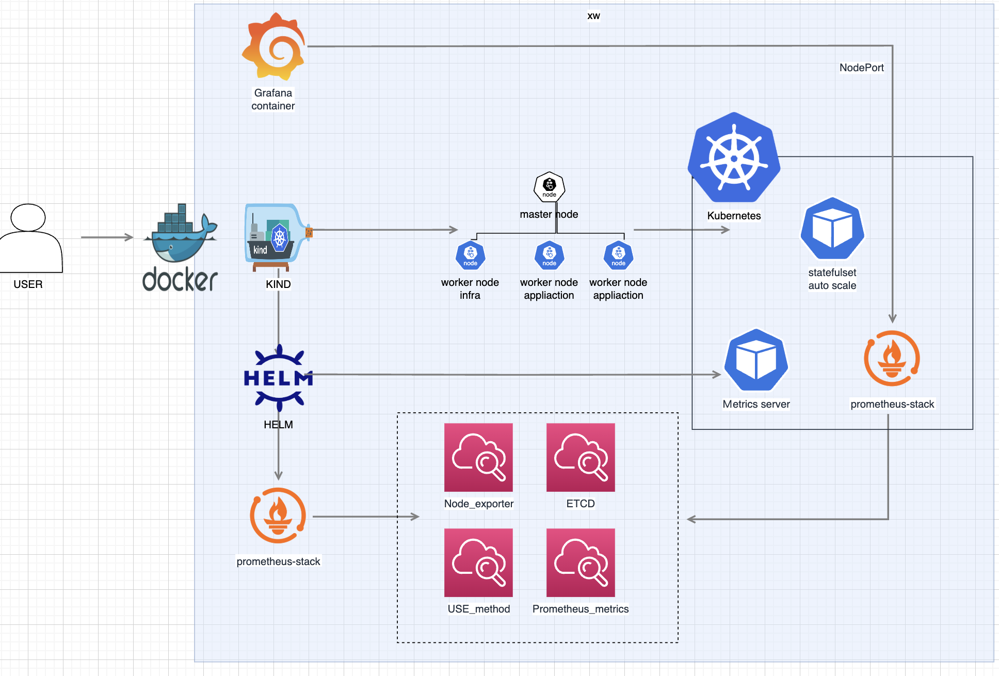

### 2. 請製作架構圖說明(圖檔)以上的架構以及操作的方法、使用到的配置檔(yaml, helm 等)、說明檔(以markdown格式呈現圖、內容)、監控儀表板螢幕截圖圖檔，上傳到github，並將github網址於收到試題，72小時內寄回。


1. 架構圖（圖檔）
    - 以圖片方式清楚說明整體架構與元件間的關係。
      

2. 操作文件
    - 配置檔以及操作說明檔請參閱 [說明文件](step.md)

3.  配置檔案
    - 1_kind - 安裝kind config
    - 3_recording_rule - 設定prometheus recording_rule 豐富 dashboard
    - 3_setting - 安裝 promethues-stack helm value.yaml metrics-server-values.yaml
    - 4_grafana - 透過docker-compose 安裝grafana / dashboard / datasource 設定備份於此
    - 5_statefulset - 設定auto scale sts 設定
    - img - dashboard 截圖 / 架構圖
4. 說明文件（Markdown 格式）
    - 配置檔以及說明檔請參閱 [說明文件](step.md)

5. 監控 drawio 截圖請至 `img` 資料夾底下查看

### 4.6 請說明以上的效能監控儀表板的每個panel內容。

1. Node exporter 以`主機`為單位出發，可以觀察主機 `cpu / memory / disk / network` 的忙碌程度
2. 以k8s角度出發觀察cluster
   1. worker node 是否有`壓力`
   2. 每個node的忙碌程度，避免`單台Node`過忙
   3. POD 是否有`失敗 / 重啟 / POD` 是否於特定時間擴增或是縮減。
   4. CronJob Pod 是否有`成功執行或是失敗紀錄`
3. recoding_rule有送進PrometheusRule但無法取出數值
   1. 以使用率 / 錯誤率等方式 觀察集群是否健康
4. etcd
   1. 是否有產生選舉，因為 cluster 架構的服務每當有選舉發生通常會有`寫入暫停 / 讀取到舊資料`等情況發生 
   2. 同步速度是否無異常
   3. key / value 增長是否正常
5. Prometheus Server 角度查看
   1. `取得各監控`反應速度是否皆正常
   2. Scrape 速度 / 錯誤 是否皆正常
   3. 是否資源皆正常


### 4.7 請說明要如何以上建立的監控儀表板觀察CPU Throttling現象或是需要再新增新的監控panel或是儀表板來監控，請說明新增的原因。

1. 如果是要看pod層級我會透過 `cadvisor` 的數值來查看是否有這情況，代表可能cpu limit該調整了
```yaml
    rate(container_cpu_cfs_throttled_periods_total[5m])
    /
    rate(container_cpu_cfs_periods_total[5m])
```
2. 如果是要查看 host有沒有這個情況透過USE的recoding_rule `node_load` 搭配 `CPU Idle time` 來查看否 host cpu 有壓力 


